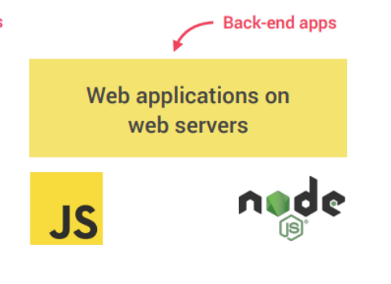
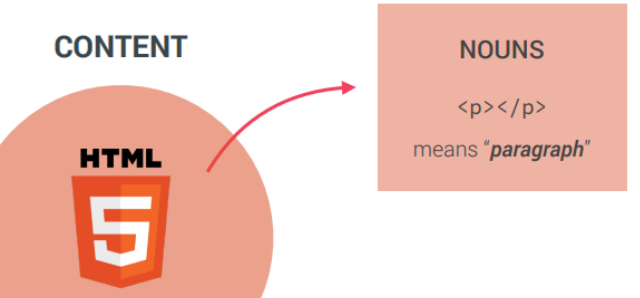

# Javascript
## Getting started with javascript 
JavaScript is a popular programming 
language that has a wide range of 
applications.
JavaScript was previously used mainly for 
making webpages interactive such as form 
validation, animation, etc. Nowadays, 
JavaScript is also used in many other areas 
such as server-side development, mobile 
app development and so on.
## JavaScript is also used in many other areas
### Effect and web

### Back-end app

### Mobile aplication

### Desctop aplication

## THE ROLE OF JAVASCRIPT IN WEB DEVELOPMENT
### Html

### Css

### Js

## A BRIEF HISTORY OF JAVASCRIPT
### 1995
Based on that, JavaScript was created by Brendan Eich in September 1995. He took inspiration from three languages—Java, Self, and Scheme—to create JavaScript. JavaScript derives its syntax from Java, its first-class functions from Scheme, and its prototype-based inheritance from Self.

The name JavaScript is a result of marketing strategies. At the beginning, Brendan Eich called it Mocha (a code name). Inside Netscape, they used the name LiveScript. Yet, when they had to choose a public name, “JavaScript” was the winner.

Why? This language was made to interest Java programmers, and “script” was trendy for describing lightweight programs back then. These lightweight “scripts” were the first to be put into pages on this new thing called the web!

On September 18, 1995, Netscape Communications Corporation released the Netscape Navigator 2.0 web browser.
### ECMA Standardization
To address this issue and promote a consistent and standardized approach, Netscape decided to submit JavaScript to ECMA for standardization in November 1996. By creating a standardized specification for JavaScript, Netscape aimed to encourage other browser vendors, including Microsoft, to adopt the standardized version. This would reduce the fragmentation caused by different implementations of the same language and ensure a more consistent experience for web developers and users across different browsers.

ECMA is an international standards organization. Its purpose is to create and maintain standards for information and communication technology. It ensures that technologies are consistent, interoperable, and well-documented, benefiting industries and users by promoting compatibility and innovation.

Every time there’s something new to set standards for, ECMA gives out a standard guide (or specification) and puts together a group of experts called a committee.

In case of JavaScript, the standard is ECMA-262 and The committee that works on ECMA-262 called Technical Committee 39 (TC39)

ECMA Decided to use the term ECMAScript to talk about the official language because Oracle (which acquired Sun Microsystems) owns the trademark for the term JavaScript.
## JAVASCRIPT RELEASES

The ECMAScript specification is a standardized specification of a scripting 
language developed by Brendan Eich of Netscape initially named Mocha, then 
LiveScript, and finally JavaScript.
Learn modern JavaScript from the beginning, but without forgetting the older 
parts!
## Run JavaScript
Because of its wide range of 
applications, you can run 
JavaScript in several ways:
#### • Using console tab of web browsers
#### • Using Node.js
#### • By creating web pages
## 1. Using Console Tab of Web Browsers
1. Open your browser and right click in any empty area and select inspect or press F12.
2. Open the developer tools and go to Console tab. Write the Javascript code and press Enter

## 2. Using Node.js
Node is a back-end environment for executing JavaScript 
code. To run JS using Node.js, follow these steps:
1. Install the latest version of Node.js.
2. Open Visual studio code and create js file
3. Run node hello.js
4. See the result

## 3. By creating web pages 
JavaScript was initially created to make web pages 
interactive, that's why JavaScript and HTML go hand in 
hand. To run JS from a webpage, follow these steps:
1. Create new folder 
2. Create index.html, script.js files
3. Write shown line of codes

## JavaScript Variables and Constants
In programming, a variable is a container (storage area) to hold data.
In Javascript there is two types of intializing variables, var and let. You can use both of them.
However, there are some differences between them.
In programming, a variable is a container (storage area) to hold data.
If you are sure that the value of a variable won't change throughout the program, it's recommended
to use const .
## Var

## let 

## const

## OBJECTS AND PRIMITIVES
### Have 2 type
### 1.Object
### 2.Primitive
## OBJECTS AND PRIMITIVES
### Primitive Types
#### 1.Number
#### 2.String
#### 3.Boolean
#### 4.Undefind
#### 5.null
#### 6.Symbol
#### 7.bigInt 
### Object types
#### 1.Object
#### 2.Array
#### 3.Function
#### 4.Many others
## Rules for Naming JavaScript Variables
1. Variable names must start with either a letter, an underscore _, or the dollar sign $.
2. Variable names cannot start with numbers. For example:
let 1simpleText = 'Javascript is really simple';
console.log(1simpleText);

## Operators IN JavaScript
### Arithmetic 
+,-,*,/
### Comparison
==,===,!=,!==,<=,>=
### Logical
||,&&,!
### Type Conversions
Number("3.14")
### Assignment
=,-=,+=,*=,...
## JavaScript Type Conversions
### There are two types of type conversion in JavaScript
####  1. Implicite type Conversion
####  2. Explixite type Conversion

# Thanks for youre attantion. Have a good day!